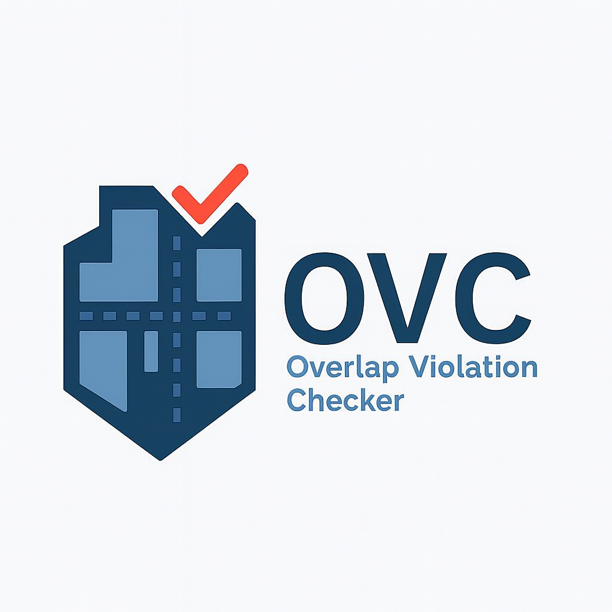

<div align="center">



# OVC Architecture Overview

**Design decisions and system structure for maintainers and contributors**

</div>

>  **For user documentation, see the [Full Documentation](docs/index.md)**

---

## Table of Contents

- [Project Structure](#project-structure)
- [Separation of Concerns](#separation-of-concerns)
- [Configuration vs Logic](#configuration-vs-logic)
- [Backward Compatibility](#backward-compatibility)
- [Design Principles](#design-principles)
- [Future Considerations](#future-considerations)

---

## Project Structure

```
ovc/
├── core/        # Core utilities and shared infrastructure
├── loaders/     # Data loading and preprocessing
├── checks/      # Building quality checks and validation logic
├── metrics/     # Statistics and summary computation
├── export/      # Output generation (files, web maps, reports)
├── road_qc/     # Road QC module (New in v1.0.2)
│   ├── checks/  # Road-specific checks
│   ├── config.py
│   ├── metrics.py
│   ├── pipeline.py
│   └── webmap.py
tests/           # Test suite
```

---

### Module: `road_qc/`

**Purpose:** Road network quality control

Contains:
- Disconnected segment detection
- Self-intersection detection
- Dangle (dead-end) detection with boundary filtering
- Road-specific web map generation

**Architecture:**
- Follows the same patterns as Building QC
- Modular checks in `road_qc/checks/`
- Unified output structure

---

### Module: `precheck/` (GeoQA Integration)

**Purpose:** Automated data-readiness assessment via the external `geoqa` dependency.

**Architecture:**
- Acts as a strict validation gate **before** the heavy OVC QC pipeline runs.
- Offloads basic topology compliance (empty, null, invalid, unprojected geometries) to the `geoqa` Python package.
- Ensures all inputs passed to OVC algorithms are fundamentally sound, preventing runtime failures mid-pipeline.
- Generates its own independent suite of HTML quality reports via `geoqa`.

---

## Separation of Concerns

OVC is intentionally split into clear, independent layers to maintain modularity and testability.

### `core/`

**Purpose:** Shared, low-level utilities and infrastructure

Contains:
- CRS handling and transformations
- Geometry helper functions
- Configuration objects
- Spatial indexing utilities

**Constraints:**
-  Must remain domain-agnostic
-  No QC-specific logic allowed
-  No I/O operations

---

### `loaders/`

**Purpose:** Data ingestion and normalization

Responsible for:
- Reading input data from local files (buildings, roads, boundaries)
- Supporting multiple formats: Shapefile, GeoJSON, GeoPackage, etc.
- Schema normalization across different sources
- Reprojecting geometries to WGS 84
- Data preprocessing and cleaning

**Constraints:**
-  Handles all data reading operations
-  Works with local files only (no network/API calls)
-  Does not perform validation or QC checks
-  Does not contain business logic

---

### `checks/`

**Purpose:** Quality control logic and validation algorithms

Contains all spatial quality checks:
- Building overlap detection
- Boundary compliance validation
- Road conflict analysis
- Topological error detection

**Each check module:**
-  Is deterministic and reproducible
-  Accepts prepared GeoDataFrames as input
-  Returns structured error outputs
-  Does not perform I/O operations
-  Does not load configuration directly

---

### `export/`

**Purpose:** Pipeline orchestration and output generation

Responsible for:
- Running the complete QC pipeline
- Writing results to disk (GeoJSON, CSV)
- Generating interactive web maps
- Producing summary reports

**Constraints:**
-  Orchestrates the entire workflow
-  Handles all output operations
-  Does not contain QC algorithms
-  Does not perform data validation

---

### `metrics/`

**Purpose:** Statistics computation and summary generation

Responsible for:
- Computing overlap statistics (counts, areas)
- Generating summary metrics for reports
- Aggregating error counts by type
- Calculating error ratios and percentages

**Constraints:**
-  Pure computation, no side effects
-  Takes prepared GeoDataFrames as input
-  Does not perform I/O operations
-  Does not perform data validation

---

## Configuration vs Logic

A **strict separation** is enforced between configuration and business logic:

### Configuration (`core/config.py`)

Defines runtime behavior:
- User-adjustable parameters
- Threshold values (e.g., overlap tolerance)
- Output preferences
- System settings

### Logic (`checks/*`)

Implements algorithms:
- Geometry operations
- Spatial analysis
- Error classification
- Validation rules

**Why this matters:**
- Prevents tight coupling between parameters and implementation
- Allows algorithms to be tested independently
- Enables configuration changes without code modifications
- Supports multiple configuration profiles

---

## Backward Compatibility

OVC maintains backward compatibility through **configuration wrappers** that support legacy API usage.

### Legacy Support

Some configuration wrappers exist to:
- Accept deprecated parameter names
- Normalize arguments internally
- Preserve behavior for existing users

### Implementation

```python
# Example: Legacy parameter support
def run_check(data, overlap_threshold=None, threshold=None):
    # Normalize to current API
    active_threshold = threshold if threshold is not None else overlap_threshold
    # ... rest of logic
```

**Benefits:**
- Existing code continues to work
- APIs can evolve gracefully
- Core logic remains unaffected
- Clear deprecation path for future versions

---

## Design Principles

OVC follows these core architectural principles:

### 1. **Explicit over Implicit**
- Function parameters are clearly named
- Dependencies are explicitly passed
- No hidden global state

### 2. **Clear Module Boundaries**
- Each module has a single, well-defined responsibility
- Cross-module dependencies are minimized
- Interfaces are clean and documented

### 3. **No Hidden Side Effects**
- Functions do not modify global state
- I/O operations are isolated to specific modules
- Pure functions whenever possible

### 4. **Testability over Convenience**
- Architecture prioritizes unit testing
- Modules can be tested in isolation
- Mock-friendly interfaces

### 5. **Backward Compatibility**
- Breaking changes are avoided when possible
- Deprecation warnings guide users to new APIs
- Legacy support is time-limited and documented

---

## Future Considerations

### Completed in v3.1.0

-  Full migration of vectorization endpoints from `unary_union` to `union_all()`.
-  Centralized `__init__.py` API exports for straightforward third-party integration.
-  Global `ERROR_COLOR_MAP` added to `ovc.export.maps`.
-  GeoQA formally decoupled as an independent upstream package for the `precheck` module.

**Short-term:**
- Deprecation of legacy configuration wrappers
- Enhanced logging and error reporting

**Medium-term:**
- Additional Building QC checks:
  - Minimum area validation
  - Attribute completeness checks
- Plugin system for custom validators

**Long-term:**
- Distributed processing support for large datasets
- Real-time validation API
- Integration with external QC frameworks

---

## Contributing to Architecture

When proposing architectural changes:

1. **Open an issue first** to discuss the design
2. **Explain the problem** you're solving
3. **Consider backward compatibility** impacts
4. **Update this document** if your PR changes structure
5. **Add tests** that validate the new architecture

---

<div align="center">

**Questions about the architecture?**

[Open an issue](https://github.com/AmmarYasser455/ovc/issues) or reach out to the maintainers.

</div>
