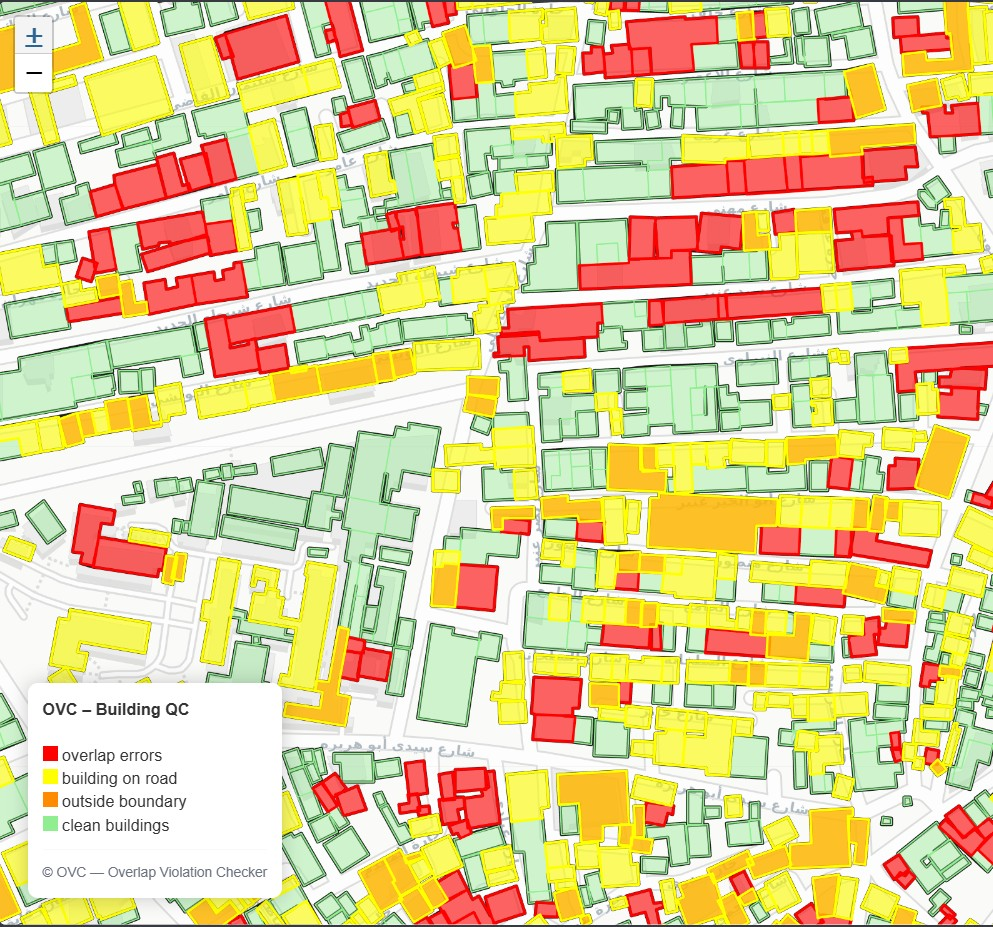
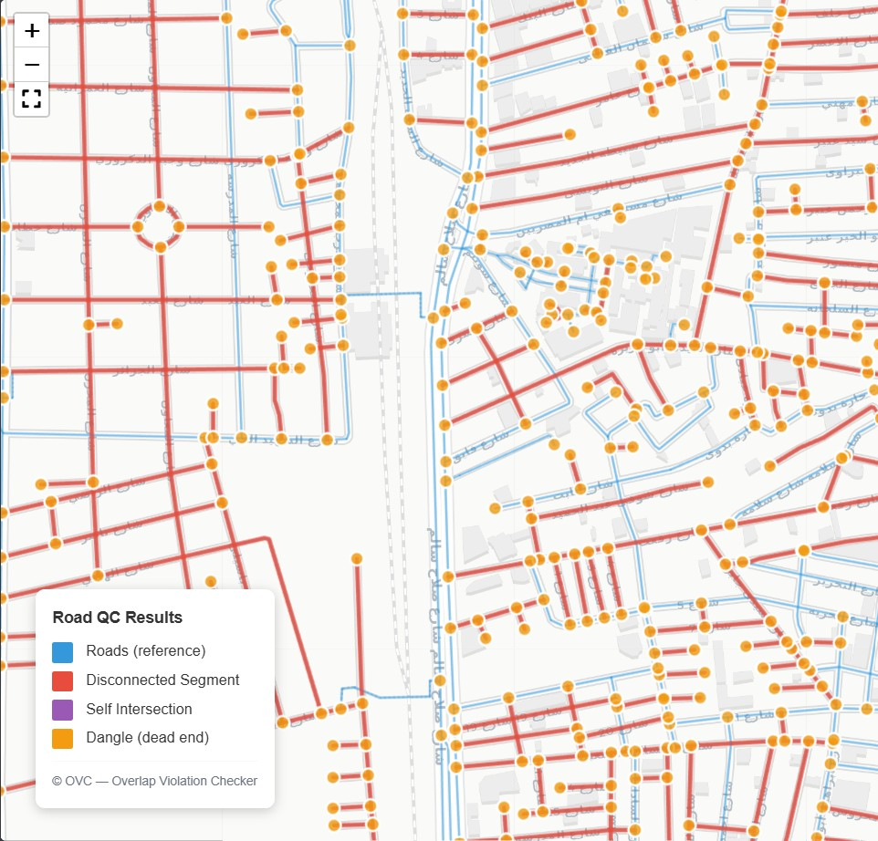

<div align="center">


# Overlap Violation Checker (OVC)

**A Python-based spatial quality control tool for detecting geometric and topological issues in building and road datasets**

<p align="center">
  
  
  
  
</p>

</div>

---

## Overview

<div align="center">

### Building QC


### Road QC


</div>

OVC validates your local geospatial data — shapefiles, GeoJSON, GeoPackage — detecting overlapping buildings, boundary violations, road conflicts, and road network issues. It produces analysis-ready outputs and interactive web maps, making it ideal for GIS quality assurance and data validation workflows.

No internet connection required. No API rate limits. Just point OVC at your data files and get results.

## Key Features

### Building QC
- **Overlap Detection** — Identify duplicate and partial overlaps in building geometries
- **Boundary Compliance** — Validate building footprints against administrative boundaries
- **Road Conflict Analysis** — Detect buildings conflicting with roads

### Road QC
- **Disconnected Segments** — Detect roads not connected to the network
- **Self-Intersections** — Find roads that cross themselves
- **Dangles** — Identify dead-end endpoints (incomplete digitization)

### Geometry Quality
- **Duplicate Geometry Detection** — Find identical building footprints
- **Invalid Geometry Detection** — Self-intersections, topology errors
- **Area Reasonableness** — Flag unreasonably small or large buildings
- **Compactness Score** — Polsby-Popper shape regularity check
- **Road Setback Violations** — Buildings too close to roads

### Shared
- **Multi-Format Input** — Shapefile, GeoJSON, GeoPackage, and more
- **Multi-Format Export** — GeoPackage, CSV, and HTML outputs
- **Interactive Visualization** — Web-based maps with legends
- **Modular Architecture** — Easily extend and customize workflows
- **No Internet Required** — Works entirely with local data

---

## Performance

| Operation | Typical Time |
|-----------|-------------|
| Building overlap detection (10k buildings) | ~20 sec |
| Road conflict detection (10k buildings) | ~30 sec |
| Full pipeline (10k buildings + roads + boundary) | ~1 min |

Key optimizations:
- Vectorized spatial joins (no Python-level loops)
- Spatial pre-filtering reduces geometry comparison count

---

## Documentation

📚 **[Full Documentation](docs/index.md)** — User Guide, Tutorials, Examples, and API Reference

---

## Requirements

### Python

OVC requires Python 3.10 or newer.

**Recommended version:**
```
Python 3.11
```

### Dependencies

OVC uses only standard geospatial Python libraries — no external APIs:

- geopandas, shapely, pyproj, pandas, folium, fiona, rtree

---

## Installation

### 1. Clone the repository

```bash
git clone https://github.com/AmmarYasser455/ovc.git
cd ovc
```

### 2. Create a virtual environment (recommended)

```bash
python -m venv venv
source venv/bin/activate    # Linux / macOS
venv\Scripts\activate       # Windows
```

### 3. Install dependencies

```bash
pip install -r requirements.txt
```

### 4. Install in development mode (optional)

```bash
pip install -e ".[dev]"
```

---

## Quick Start

OVC works with your **local data files**. You provide the data — OVC runs the checks.

### ✅ Option 1: Buildings only (minimum required)

```bash
python scripts/run_qc.py \
  --buildings path/to/buildings.shp \
  --out outputs
```

In this mode OVC detects building overlaps. Road conflict and boundary checks are skipped.

### ✅ Option 2: Buildings + Roads

```bash
python scripts/run_qc.py \
  --buildings path/to/buildings.shp \
  --roads path/to/roads.shp \
  --out outputs
```

### ✅ Option 3: Buildings + Roads + Boundary

```bash
python scripts/run_qc.py \
  --buildings path/to/buildings.shp \
  --roads path/to/roads.shp \
  --boundary path/to/boundary.geojson \
  --out outputs
```

### ✅ Option 4: Enable Road QC

```bash
python scripts/run_qc.py \
  --buildings path/to/buildings.shp \
  --roads path/to/roads.shp \
  --road-qc \
  --out outputs
```

### ✅ Option 5: Use the Python API directly

```python
from ovc.export.pipeline import run_pipeline
from pathlib import Path

outputs = run_pipeline(
    buildings_path=Path("data/buildings.shp"),
    roads_path=Path("data/roads.shp"),
    boundary_path=Path("data/boundary.shp"),
    out_dir=Path("outputs"),
)
print(f"GeoPackage: {outputs.gpkg_path}")
print(f"Web map:    {outputs.webmap_html}")
```

### ✅ Option 6: Run geometry quality checks

```python
from ovc.checks.geometry_quality import (
    find_duplicate_geometries,
    find_invalid_geometries,
    find_unreasonable_areas,
    compute_compactness,
    find_min_road_distance_violations,
)

# buildings_metric = ... (GeoDataFrame in metric CRS)
dupes = find_duplicate_geometries(buildings_metric)
invalid = find_invalid_geometries(buildings_metric)
area_issues = find_unreasonable_areas(buildings_metric, min_area_m2=4.0)
compact = compute_compactness(buildings_metric, min_compactness=0.2)
setback = find_min_road_distance_violations(buildings_metric, roads_metric, min_distance_m=3.0)
```

### ℹ️ Notes

- `--buildings` is **required** — this is the data OVC checks
- `--boundary` is optional — enables boundary overlap and outside-boundary checks
- `--roads` is optional — enables building-on-road conflict checks
- `--road-qc` requires `--roads` — runs road network quality checks
- All input files can be Shapefile, GeoJSON, GeoPackage, or any format supported by Fiona

---

## Outputs

Both modules produce outputs in a unified folder structure:

```
outputs/
├── building_qc/
│   ├── building_qc.gpkg          # GeoPackage with layers
│   ├── building_qc_map.html      # Interactive web map
│   └── building_qc_metrics.csv   # Summary metrics
└── road_qc/                      # Only when --road-qc is enabled
    ├── road_qc.gpkg
    ├── road_qc_map.html
    └── road_qc_metrics.csv
```

| Output Type | Description |
|------------|-------------|
| **GeoPackage** | Spatial layers containing detected issues |
| **CSV reports** | Summary statistics and metrics |
| **HTML web map** | Interactive map for visual inspection |

---

## Configuration

Runtime thresholds and validation settings can be customized in:

```
ovc/core/config.py
```

Key configurable parameters:

| Parameter | Default | Description |
|-----------|---------|-------------|
| `duplicate_ratio_min` | 0.98 | Minimum overlap ratio for duplicate classification |
| `partial_ratio_min` | 0.30 | Minimum overlap ratio for partial classification |
| `min_intersection_area_m2` | 0.5 | Minimum overlap area threshold |
| `road_buffer_m` | 1.0 | Buffer distance around roads |

---

## Troubleshooting

### CRS warnings

- All input data is automatically reprojected to WGS 84 and then to UTM
- If your data uses a local CRS, ensure it has a `.prj` file

### Out of memory

- **Cause**: Very large areas (>500 km²) may exhaust RAM
- **Fix**: Process in smaller boundary chunks or increase system RAM

### Slow processing

- **Cause**: Large building datasets with O(n²) overlap comparisons
- **Fix**: Vectorized spatial joins are used automatically (10–50× faster than iterrows)
- **Workaround**: Filter input data to area of interest before processing

---

## Testing

Run the full test suite:

```bash
pytest
```

Run with coverage:

```bash
pytest --cov=ovc --cov-report=html
```

---

## Architecture

For detailed design decisions and module responsibilities, see:

**[ARCHITECTURE.md](ARCHITECTURE.md)**

---

## License

This project is licensed under the **MIT License**. See [LICENSE](LICENSE) for details.

---

## Author

**Ammar Yasser**

- GitHub: [@AmmarYasser455](https://github.com/AmmarYasser455)

---

## Contributing

Contributions, issues, and feature requests are welcome!

Please read our **[CONTRIBUTING.md](CONTRIBUTING.md)** guide for details.

Feel free to check the [issues page](https://github.com/AmmarYasser455/ovc/issues) to get started.

---

<div align="center">

**⭐ If you find this project useful, please consider giving it a star!**

</div>
