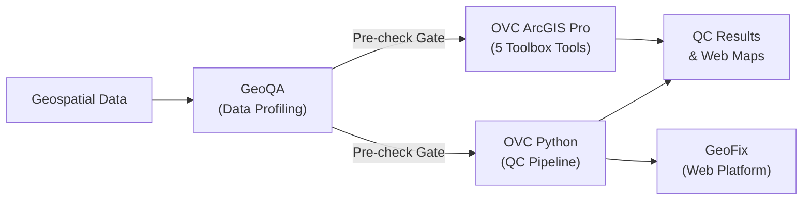
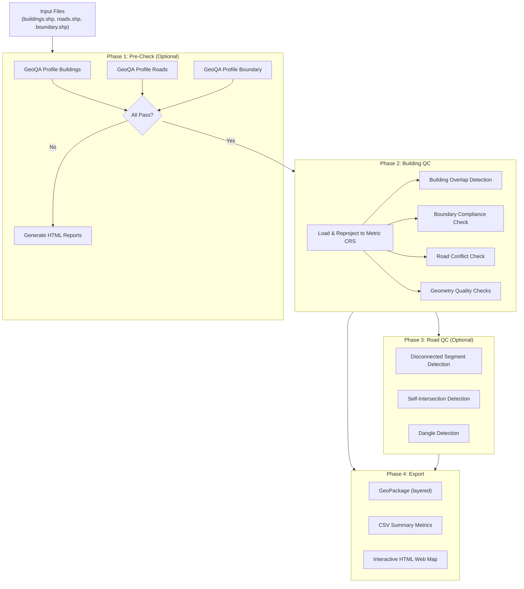

# OVC — Product Requirements Document

**Full Name:** Overlap Violation Checker
**Version:** 3.2.0
**Author:** Ammar Yasser Abdalazim
**License:** MIT
**Python:** 3.10+
**Repository:** [github.com/AmmarYasser455/ovc](https://github.com/AmmarYasser455/ovc)

---

## 1. Overview

OVC (Overlap Violation Checker) is a Python-based spatial quality control tool for detecting geometric and topological issues in **building and road datasets**. It validates local geospatial data — Shapefiles, GeoJSON, GeoPackage — detecting overlapping buildings, boundary violations, road conflicts, and road network problems. It operates entirely offline with no API rate limits.

OVC is designed for GIS professionals, urban planners, and mapping agencies who need to validate building footprint and road network datasets before submission, publication, or integration into national spatial databases.

### 1.1 Ecosystem Position

OVC is part of a three-tool geospatial quality control ecosystem:



| Tool | Role | Interface |
|---|---|---|
| **GeoQA** | Data-readiness gate — profiles, validates, and scores datasets | Python API + CLI + PyPI |
| **OVC** | Core QC engine — overlap, boundary, road, and geometry checks | Python API + CLI |
| **OVC ArcGIS Pro** | Enterprise desktop — 5 toolbox tools for ArcGIS Pro users | ArcGIS Python Toolbox |
| **GeoFix** | Web platform — AI-powered interface using OVC + GeoQA engines | Web app (geofix.me) |

---

## 2. Actual Use

### 2.1 Who Uses OVC

- **Government mapping agencies** validating building footprint databases before publication
- **Urban planning departments** checking building datasets for overlaps and boundary compliance
- **GIS consultants** performing quality control on survey data deliverables
- **OpenStreetMap contributors** checking import datasets for geometric issues
- **Students and researchers** in geospatial data quality courses

### 2.2 Real-World Workflow

A typical QC workflow with OVC:

1. **Receive** building footprints and road centerlines as Shapefiles from field survey teams
2. **Run GeoQA pre-check** (`--precheck`) to gate data quality — catches missing CRS, invalid geometries, empty features
3. If pre-check passes → **Run OVC Building QC** — detects overlaps, boundary violations, road conflicts
4. **Run OVC Road QC** (`--road-qc`) — detects disconnected segments, self-intersections, dangles
5. **Review** interactive HTML web map with color-coded issue layers
6. **Export** GeoPackage + CSV report for field correction teams
7. Field teams fix issues → re-run OVC to verify

### 2.3 How to Run

**CLI Usage:**

```bash
# Minimum — buildings only
python scripts/run_qc.py --buildings buildings.shp --out outputs

# Full pipeline — buildings + roads + boundary + pre-check
python scripts/run_qc.py \
    --buildings buildings.shp \
    --roads roads.shp \
    --boundary boundary.shp \
    --road-qc \
    --precheck \
    --out outputs

# Pre-check only (skip QC)
python scripts/run_qc.py --buildings buildings.shp --precheck-only --out outputs
```

**Python API:**

```python
from ovc.export.pipeline import run_pipeline
from pathlib import Path

outputs = run_pipeline(
    buildings_path=Path("data/buildings.shp"),
    roads_path=Path("data/roads.shp"),
    boundary_path=Path("data/boundary.shp"),
    out_dir=Path("outputs"),
)
print(f"GeoPackage: {outputs.gpkg_path}")
print(f"Web map:    {outputs.webmap_html}")
```

**Individual Geometry Checks API:**

```python
from ovc.checks.geometry_quality import (
    find_duplicate_geometries,
    find_invalid_geometries,
    find_unreasonable_areas,
    compute_compactness,
    find_min_road_distance_violations,
)

dupes = find_duplicate_geometries(buildings_gdf)
invalid = find_invalid_geometries(buildings_gdf)
area_issues = find_unreasonable_areas(buildings_gdf, min_area_m2=4.0)
compact = compute_compactness(buildings_gdf, min_compactness=0.2)
setback = find_min_road_distance_violations(buildings_gdf, roads_gdf, min_distance_m=3.0)
```

---

## 3. Architecture

### 3.1 Module Structure

```
ovc/                          # Root package
├── __init__.py               # Public API exports (run_pipeline, geometry checks)
│
├── core/                     # Shared utilities
│   ├── config.py             # Runtime thresholds (overlap ratios, buffer distances)
│   ├── crs.py                # CRS detection, transformation, metric projection
│   ├── geometry.py           # Geometry repair, validation, cleaning
│   ├── logging.py            # Logging setup
│   └── spatial_index.py      # R-tree spatial index helpers
│
├── loaders/                  # Data loading and preprocessing
│   └── (multi-format file loading via GeoPandas/Fiona)
│
├── checks/                   # Building quality checks
│   ├── __init__.py           # Check registry and exports
│   ├── overlap.py            # Building overlap detection (duplicate + partial)
│   ├── boundary_overlap.py   # Building vs. boundary compliance
│   ├── road_conflict.py      # Building vs. road conflict detection
│   └── geometry_quality.py   # Duplicates, invalid, area, compactness, setback
│
├── metrics/                  # Statistics and summary computation
│   └── (summary metrics aggregation for CSV reports)
│
├── export/                   # Output generation
│   ├── pipeline.py           # Main QC pipeline orchestrator (11.8KB)
│   ├── geopackage.py         # GeoPackage export with multiple layers
│   ├── webmap.py             # Folium interactive web map generation
│   ├── tables.py             # Summary tables and CSV output
│   └── maps.py               # Map configuration and styling
│
├── precheck/                 # GeoQA integration
│   └── (data quality gate before QC pipeline)
│
└── road_qc/                  # Road network quality control
    ├── __init__.py
    ├── config.py             # Road QC specific thresholds
    ├── pipeline.py           # Road QC pipeline orchestrator (7KB)
    ├── metrics.py            # Road QC metrics aggregation
    ├── webmap.py             # Road QC web map generation (7.8KB)
    └── checks/               # Road-specific checks
        └── (disconnected, self-intersection, dangle detection)
```

### 3.2 Pipeline Flow



---

## 4. Quality Checks (Detailed)

### 4.1 Building QC Checks

| Check | Module | Algorithm | Configurable Parameters |
|---|---|---|---|
| **Duplicate Overlap** | `overlap.py` | Vectorized spatial join → filter by overlap ratio ≥ `duplicate_ratio_min` (default: 0.98) | `duplicate_ratio_min` |
| **Partial Overlap** | `overlap.py` | Vectorized spatial join → filter by overlap ratio between `partial_ratio_min` and `duplicate_ratio_min` | `partial_ratio_min` (default: 0.30) |
| **Boundary Outside** | `boundary_overlap.py` | Buildings with centroid outside boundary polygon | — |
| **Boundary Touching** | `boundary_overlap.py` | Buildings intersecting boundary edge | — |
| **Road Conflict** | `road_conflict.py` | Buildings intersecting buffered road geometries | `road_buffer_m` (default: 1.0m) |
| **Duplicate Geometry** | `geometry_quality.py` | WKB hash comparison for identical footprints | — |
| **Invalid Geometry** | `geometry_quality.py` | `shapely.is_valid` + `explain_validity()` | — |
| **Unreasonable Area** | `geometry_quality.py` | Z-score based outlier detection on area distribution | `min_area_m2` (default: 4.0) |
| **Low Compactness** | `geometry_quality.py` | Polsby-Popper ratio: `4π × area / perimeter²` < threshold | `min_compactness` (default: 0.2) |
| **Road Setback** | `geometry_quality.py` | Minimum distance from building to nearest road < threshold | `min_distance_m` (default: 3.0) |

### 4.2 Road QC Checks

| Check | Module | Algorithm |
|---|---|---|
| **Disconnected Segments** | `road_qc/checks/` | Graph connectivity analysis — roads not connected to main network |
| **Self-Intersections** | `road_qc/checks/` | `shapely` intersection detection on individual road geometries |
| **Dangles** | `road_qc/checks/` | Dead-end endpoint detection (nodes with degree=1) at non-boundary locations |

---

## 5. Configuration

### 5.1 Runtime Thresholds (`ovc/core/config.py`)

| Parameter | Default | Description |
|---|---|---|
| `duplicate_ratio_min` | `0.98` | Minimum intersection/union ratio for duplicate classification |
| `partial_ratio_min` | `0.30` | Minimum intersection/union ratio for partial overlap |
| `min_intersection_area_m2` | `0.5` | Minimum overlap area to report (filters noise) |
| `road_buffer_m` | `1.0` | Buffer distance around roads for conflict detection |

### 5.2 CLI Arguments

| Argument | Required | Description |
|---|---|---|
| `--buildings` | ✅ | Path to building footprint dataset |
| `--roads` | No | Path to road centerline dataset |
| `--boundary` | No | Path to administrative boundary dataset |
| `--out` | ✅ | Output directory for results |
| `--road-qc` | No | Enable road network quality checks (requires `--roads`) |
| `--precheck` | No | Run GeoQA pre-check before QC pipeline |
| `--precheck-only` | No | Run only GeoQA pre-check, skip QC |

---

## 6. Outputs

### 6.1 Output Directory Structure

```
outputs/
├── precheck/                        # Only when --precheck is used
│   ├── buildings_quality_report.html
│   ├── roads_quality_report.html
│   └── boundary_quality_report.html
├── building_qc/
│   ├── building_qc.gpkg             # GeoPackage with issue layers
│   ├── building_qc_map.html         # Interactive Folium web map
│   └── building_qc_metrics.csv      # Summary metrics table
└── road_qc/                         # Only when --road-qc is used
    ├── road_qc.gpkg
    ├── road_qc_map.html
    └── road_qc_metrics.csv
```

### 6.2 GeoPackage Layers

The output GeoPackage contains separate layers for each issue type:

| Layer | Content |
|---|---|
| `clean_buildings` | Buildings with no detected issues |
| `duplicate_overlaps` | Buildings classified as duplicates (≥98% overlap) |
| `partial_overlaps` | Buildings with partial overlaps (30-98%) |
| `boundary_violations` | Buildings outside or touching boundary |
| `road_conflicts` | Buildings conflicting with road geometries |
| `duplicate_geometries` | Buildings with identical WKB geometry |
| `invalid_geometries` | Buildings failing OGC validity |
| `unreasonable_areas` | Buildings with outlier areas |
| `low_compactness` | Buildings with irregular shapes |
| `setback_violations` | Buildings too close to roads |

### 6.3 Interactive Web Map

Folium-based HTML map with:
- Color-coded issue layers (red=overlap, orange=invalid, magenta=duplicate, etc.)
- Toggle layers on/off via layer control
- Popups with feature attributes and issue details
- Multiple basemap options
- Auto-zoom to data extent

---

## 7. Dependencies

| Package | Version | Purpose |
|---|---|---|
| `geopandas` | ≥0.14, <1.0 | Core geospatial data processing |
| `shapely` | ≥2.0, <3.0 | Geometry operations and validation |
| `pyproj` | ≥3.6, <4.0 | CRS transformations |
| `pandas` | ≥2.0, <3.0 | Tabular data processing |
| `folium` | ≥0.15, <1.0 | Interactive web map generation |
| `fiona` | ≥1.9, <2.0 | Multi-format geospatial file I/O |
| `rtree` | ≥1.1, <2.0 | Spatial indexing for fast queries |
| `geoqa` | latest | Pre-check data quality gate |

**Dev dependencies:** `pytest`, `pytest-cov`, `pre-commit`

---

## 8. Performance

| Operation | Dataset Size | Typical Time |
|---|---|---|
| Building overlap detection | 10,000 buildings | ~20 seconds |
| Road conflict detection | 10,000 buildings | ~30 seconds |
| Full pipeline (buildings + roads + boundary) | 10,000 buildings | ~1 minute |
| Geometry quality checks | 10,000 buildings | ~5 seconds |

**Key Optimizations:**
- Vectorized spatial joins via GeoPandas (no Python-level loops)
- R-tree spatial pre-filtering reduces geometry comparison count by 90%+
- Metric CRS auto-projection for accurate area/distance calculations

---

## 9. Supported Formats

All vector formats readable by GeoPandas/Fiona via GDAL/OGR drivers:

| Format | Extension | Notes |
|---|---|---|
| Shapefile | `.shp` | Requires .dbf, .shx, .prj companion files |
| GeoJSON | `.geojson`, `.json` | |
| GeoPackage | `.gpkg` | Recommended for output |
| KML | `.kml` | |
| GML | `.gml` | |
| File Geodatabase | `.gdb` | Requires GDAL with FileGDB driver |

---

## 10. Testing

```bash
pytest                              # Run full test suite
pytest --cov=ovc --cov-report=html  # Run with coverage report
```

Test infrastructure uses `pytest` with coverage reporting. Tests are located in the `tests/` directory.

---

## 11. Integration with GeoFix

OVC is installed as a Git dependency in GeoFix:
```
# In GeoFix requirements.txt
git+https://github.com/AmmarYasser455/ovc.git
```

GeoFix's `OVCService` wraps OVC's check functions and runs them on uploaded GeoDataFrames, returning styled GeoJSON layers for the web map interface. The service calls `run_checks()` which executes overlap, invalid geometry, duplicate, area, and compactness checks, then returns color-coded clean and error GeoJSON FeatureCollections.

---

## 12. Changelog Highlights

| Version | Key Changes |
|---|---|
| **v3.2.0** | Version bump, GeoQA integration updates |
| **v3.0.0** | Major refactor — modular architecture, road QC, GeoQA pre-check, pipeline API |
| **v2.x** | Added geometry quality checks, web map visualization |
| **v1.x** | Initial overlap detection for buildings |
