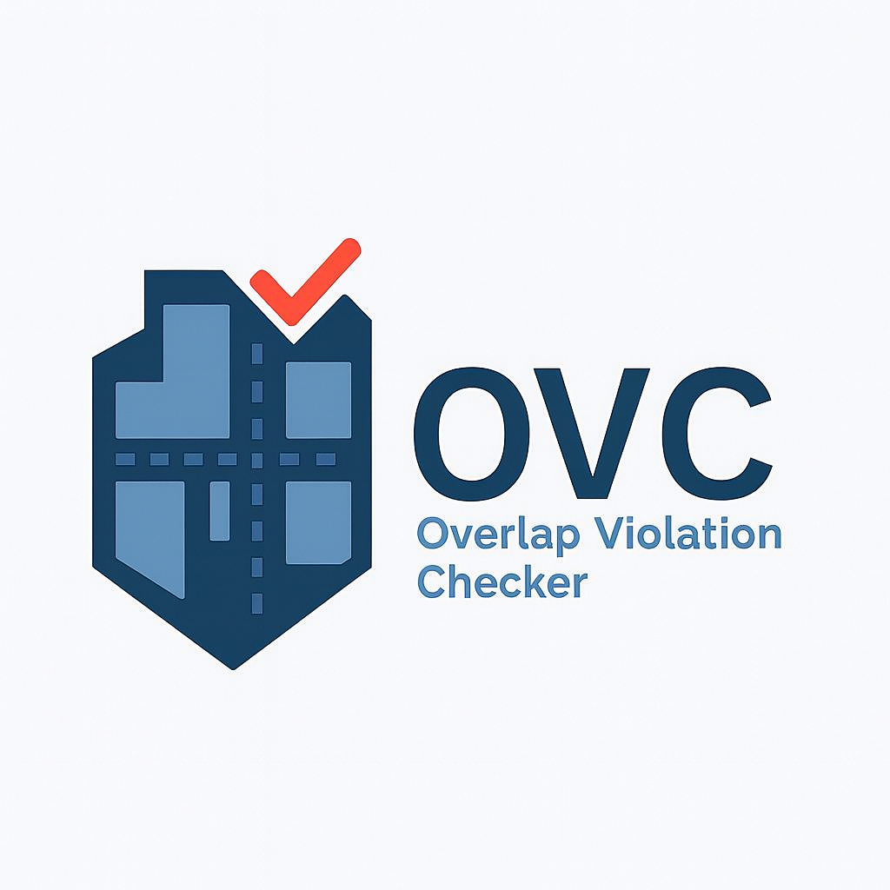
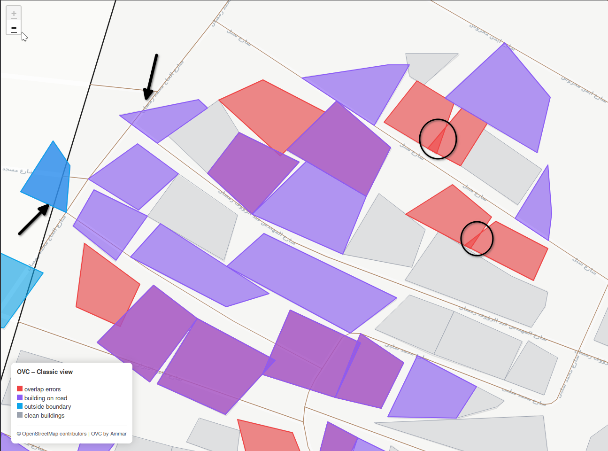

<div align="center">



# Overlap Violation Checker (OVC)

**A modular spatial quality control framework for detecting geometric and topological issues in OpenStreetMap‑like datasets**

<p align="center">
  
  
  
</p>

</div>

---

## Overview

<div align="center">

</div>

OVC is a **Python‑based spatial quality control framework** designed to identify geometric and topological issues in geospatial datasets, with a strong focus on OpenStreetMap‑derived data.

**Building QC** detects:
- Overlapping and duplicate building geometries
- Boundary containment violations
- Road–building conflicts

**Road QC** (New in v1.0.2) detects:
- Disconnected road segments not connected to the network
- Self-intersecting roads
- Dangle endpoints (dead ends, incomplete digitization)

OVC is built around **clear architectural boundaries**, making it suitable for:
- Command‑line usage
- Automated QC pipelines
- Integration into GIS and ETL workflows
- Extension by contributors and advanced users

---

## Documentation

| Document | Description |
|----------|-------------|
| **[User Guide](user-guide.md)** | Installation, configuration, CLI usage, troubleshooting |
| **[Tutorials](tutorials.md)** | Step-by-step learning paths from beginner to advanced |
| **[Examples](examples.md)** | Practical code snippets and real-world use cases |
| **[API Reference](api-reference.md)** | Python API documentation for programmatic usage |
| **[Architecture](../ARCHITECTURE.md)** | Design decisions and system structure for contributors |

---

## Design Philosophy

OVC is intentionally designed as a **framework**, not a monolithic script.

Key principles:
- **Separation of concerns** between data loading, validation logic, and output generation
- **Configuration‑driven behavior** without hard‑coded thresholds
- **Deterministic, testable QC checks**
- **No hidden side effects or implicit state**

For architectural details, see:
👉 **[Architecture Overview](../ARCHITECTURE.md)**

---

## Core Capabilities

### Building QC

| Check | Description |
|-------|-------------|
| **Overlap Detection** | Identify duplicate and partial building overlaps |
| **Boundary Compliance** | Flag buildings outside or crossing boundaries |
| **Road Conflicts** | Detect buildings intersecting road buffers |

### Road QC (New in v1.0.2)

| Check | Description |
|-------|-------------|
| **Disconnected Segments** | Roads not connected to the network |
| **Self-Intersections** | Roads that cross themselves |
| **Dangles** | Dead-end endpoints (filters boundary edges) |

### Data Handling
- Accept user‑provided datasets or fetch data from OpenStreetMap
- Normalize schemas across heterogeneous sources
- Reproject data to metric CRS for accurate spatial analysis
- Scale to large datasets through spatial indexing

### Output & Reporting
- Export violations as **GeoPackage** and **CSV**
- Generate interactive **HTML web maps** with legends
- Produce analysis‑ready outputs for GIS software
- Maintain consistent, structured result schemas

### Automation & Extensibility
- Command‑line interface for batch processing
- Modular QC checks that can be extended independently
- Clean Python API for advanced workflows
- Designed for CI/CD and scheduled validation runs

---

## Typical Use Cases

### Data Quality Assurance
- Pre‑publication validation of OSM contributions
- Continuous QC for institutional OSM deployments
- Compliance checks against administrative boundaries

### Road Network Analysis
- Detect disconnected road segments
- Find incomplete digitization (dangles)
- Identify self-intersecting roads

### GIS & ETL Workflows
- Cleaning building inventories before analysis
- Detecting conflicts in road networks
- Automated QC steps in spatial pipelines

### Urban & Infrastructure Analysis
- Validation of digitized building footprints
- Conflict detection in dense urban environments
- Pre‑processing for planning and analytics tools

---

## Getting Started

### Installation

Clone the repository:
```bash
git clone https://github.com/AmmarYasser455/ovc.git
cd ovc
```

Create a virtual environment (recommended):
```bash
python -m venv venv
source venv/bin/activate    # Linux / macOS
venv\Scripts\activate       # Windows
```

Install dependencies:
```bash
pip install -e .
```

### Quick Start

**Building QC only:**
```bash
python scripts/run_qc.py \
  --buildings path/to/buildings.shp \
  --out outputs
```

**Building + Road QC:**
```bash
python scripts/run_qc.py \
  --boundary path/to/boundary.geojson \
  --road-qc \
  --out outputs
```

For more usage options, see the **[User Guide](user-guide.md)**.

---

## Outputs

Both modules produce outputs in a unified folder structure:

```
outputs/
├── building_qc/
│   ├── building_qc.gpkg          # GeoPackage with layers
│   ├── building_qc_map.html      # Interactive web map
│   └── building_qc_metrics.csv   # Summary metrics
└── road_qc/                      # Only when --road-qc is enabled
    ├── road_qc.gpkg
    ├── road_qc_map.html
    └── road_qc_metrics.csv
```

| Output Type | Description |
|------------|-------------|
| **GeoPackage** | Spatial layers containing detected issues |
| **CSV reports** | Summary statistics and metrics |
| **HTML web map** | Interactive map for visual inspection |

---

## Requirements

- Python 3.10+
- GeoPandas
- Shapely
- PyProj
- Pandas
- Folium
- OSMnx

For the complete dependency list, refer to `pyproject.toml`.

---

## Next Steps

- **New users:** Start with the [User Guide](user-guide.md) for installation and CLI usage
- **Learn by doing:** Follow the [Tutorials](tutorials.md) for hands-on learning
- **Quick reference:** Browse [Examples](examples.md) for copy-paste solutions
- **Developers:** Explore the [API Reference](api-reference.md) for Python integration
- **Contributors:** Read the [Architecture](../ARCHITECTURE.md) documentation

---

<div align="center">

**Questions or issues?**

[Open an issue](https://github.com/AmmarYasser455/ovc/issues) or check the [User Guide](user-guide.md) for troubleshooting.

</div>
